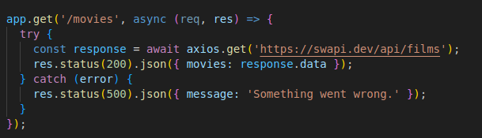
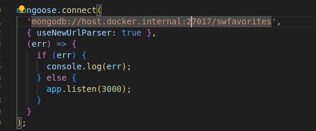
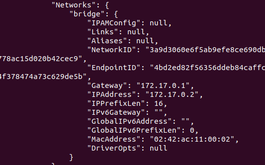
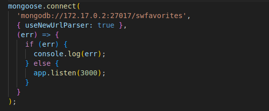
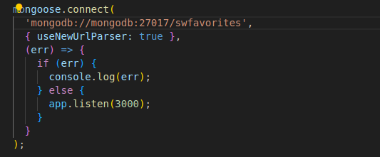

# Docker Communication

This document outlines different types of communication scenarios within Docker containers.

## Types of Communication
    1) . Container to the internet communication
    2) . container to the applications on the host machine communication
    3) . Container to Container communication


# Docker network --help

```
  whenever you need clarification on Docker networking commands, remember to run docker network --help
```

### 1) Container to Internet Communication

Sending requests from inside the container to the internet works out of the box. No special configuration is needed for this.

Example:

1) run `docker run -p 8000:3000 imageName`
2) once the container is up run `http://localhost:8000/movies`
3) Axios will send and fetch the request from the swapi api internet address and return the response


### 2) Container to Applications on the Host Machine Communication

This scenario involves communication between a container and applications running directly on the host machine where Docker is installed. Configurations may be required to enable seamless communication.

When a Docker container needs to communicate with applications running directly on the host machine where Docker is installed, you can use the DNS name `host.docker.internal` within the container to refer to the host machine itself. This DNS name resolves to the internal IP address of the host machine from within the container.

Example: 

- if you have a nodejs app running on a container and this nodejs app needs to connect to the mongodb database in your local pc, then  adjust the MongoDB connection URL to point to the MongoDB instance running on your local machine using `host.docker.internal` as shown below.


-  Docker handles the translation of `host.docker.internal` to the appropriate IP address of the host machine, allowing seamless communication between the container and the applications on the host. You only have to repace `localhost` with`host.docker.internal`

This feature is particularly useful during development or testing when you need containers to access services running directly on the host machine.

### 3) Container to Container Communication

Communication between Docker containers running on the same host or across different hosts. Docker provides mechanisms like Docker networks to facilitate this communication.

#### Case 1: Using Container IP Addresses

Initially, you can use the IP address of another container to establish communication:

1. For example, if you're running a MongoDB container with the mongo image using the command `docker run -d --name mongodb mongo`, "mongodb" is the container name. Suppose your Node.js backend application, running in a separate container, needs to connect to MongoDB. In this case, you'll use the IP address of the MongoDB container as the connection URL.

    ```
    docker inspect mongodb
    ```

    This command will provide the IP address of the MongoDB container, which you'll use to establish the connection in your Node.js application.

    ### Explaining the Docker Run Command

To understand the command `docker run -d --name mongodb mongo`, let's break it down:

- `docker run`: This command is used to create and start a new container based on a specified image.

- `-d`: This flag stands for "detached mode." It instructs Docker to run the container in the background, allowing you to continue using the terminal after starting the container.

- `--name mongodb`: This flag assigns a name to the container. In this case, the container is named "mongodb."

- `mongo`: This is the name of the Docker image used to create the container. I

So, when you run this command, Docker will start a new container named "mongodb" using the "mongo" image. The container will run in detached mode, meaning it runs in the background, and you'll be returned to your terminal prompt. This container will likely be running an instance of MongoDB, ready to accept connections and store data.


2. Locate the <span style="font-size:20px"><b>IPAddress</b></span> under the network section.

3. Utilize this IP address in the container from which you want to reach the target container.


However, relying solely on container IP addresses can be cumbersome, as rebuilding images is necessary whenever IP addresses change.

To simplify container communication, Docker networks offer a more efficient solution as illustrated  in case 2 below:

#### Case 2: Leveraging Docker Networks


1. Start by creating a new Docker network using `docker network create network_name`, where "network_name" can be any chosen name. eg: `docker network create favorite-mongo`
2. After creation, verify the network's existence by running `docker network ls`, where your newly created network will be listed.
3. Next, launch containers within this network using `docker run -d --name containerName --network Network_name image`.

    ```
    When containers belong to the same network, they can communicate with each other seamlessly.
    ```

Connecting containers within this network involves the following steps:

1. Identify the name of the container created with the `--network` command by running `docker ps`.
2. Assuming your application in one container needs to connect to another container, such as a database like MongoDB, replace "localhost" in the connection URL with the name of the target container.
3. Ensure that all containers launched with the `docker run` command include the `--network` flag to join the specified network.

Example:
    
<span> Assume you have a nodejs app in one container connecting to a mongodb container.

1) we create the network `docker network create favorite-mongodb`
2) we can view our network using `docker network ls`. Our network will be there
3) Create the mongodb container using the official public mongodb image using the following command. `docker run -d --rm --name mongodb --network favorite-mongodb mongo`. NB: <b><i>mongodb</i></b> is the name of our container. otherwise run `docker ps`
4) Go to your code and on the mongodb connection string add the container name as shown in the image below

5) create the image using `docker build -t favorite:movies  .`
6) After the image creation, now create the container using the respective image. `docker run -d --rm --name favorite-movies -p 8000:3000 --network favorite-mongodb favorites:mongo `
7) NB: Under the network flag, mongo and nodejs names are simmilar.
8) run `docker ps` to check if your containers are running
9) since they are running in detached mode run `docker logs containerName` to check for logs eg error logs
10) use POSTMAN or any other API client to run an api endpoint that sends or fetches data from the mongo. 
11) All should be successfull.

<span style="font-size:30px"> NB: </span>

#### REACT APPLICATIONS OR APPS THAT RUN ON THE BROWSER

- For apps that run on the browser we will still need to retain the `localhost` key in the url. This is because docker only works on the client server code that spins react but not on the browser so the docker container name wouldn't be understood

- So assuming you had a react app in one container, nodejs app in another and mongodb in another then:
    1)  create a network to connect both mongodb and nodejs
            1) To create a network `docker network create mongo-nodeee`
            2) for mongo: `docker run -d --name mongodb --network mongo-node mongo`
            3) Container for node app: `docker run -d --name nodeApp --network mongo-node -p 8000:80 backendImage`
            4) For React `docker run -d --name frontend -p 3000:3000 frontendImage`
    2) NB: in step 3 above, on node we still have to use the `--network` flag in order to connect to the <b>mongo</b> container and still use the `-p` port flag in order for react to connect to it through `localhost` since react code runs on the browser


# How docker resolves IP Addresses.

Docker resolves IP addresses through its networking subsystem, which manages communication between containers, between containers and the host machine, and between containers and external networks. Docker provides different networking options, each with its own way of resolving IP addresses:

# Docker Networks and Drivers

Docker Networks support different kinds of "Drivers" that influence the behavior of the network.

The default driver is the "bridge" driver, providing the behavior where containers can find each other by name if they are in the same network.

The driver can be set when creating a network using the `--driver` option:

```bash
docker network create --driver bridge my-net
```
If you want to use the "bridge" driver, you can omit the --driver option since "bridge" is the default.

Docker also supports alternative drivers, although the "bridge" driver is most commonly used:

1) host: Removes isolation between container and host system for standalone containers (they share localhost as a network).
2) overlay: Allows multiple Docker daemons running on different machines to connect with each other. Works only in "Swarm" mode, which is a dated or almost deprecated way of connecting multiple containers.
3) macvlan: Lets you set a custom MAC address to a container for communication purposes.
none: Disables all networking.
4) Third-party plugins: Enables installation of third-party plugins, adding various behaviors and functionalities.

```
In most scenarios, the "bridge" driver is the most suitable choice.
```

## Summary

Docker communication involves interactions between containers and the internet, between containers and applications on the host machine, and between containers themselves. Each scenario may require different configurations or considerations to ensure smooth communication.


