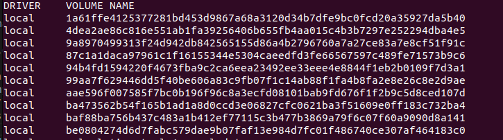
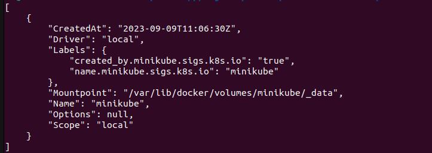

# Types of Data in Docker Volumes  based on data persistence

When working with Docker, it's essential to understand the different types of data involved, especially concerning volumes. Here's a breakdown of the types of data:

1. **Application (Code + Environment)**:
   - This data encompasses the contents of the Docker image itself, including the application code, dependencies, runtime environment, and other necessary files.
   - It's stored within Docker images and is read-only.
   - While not directly managed by Docker volumes, it serves as the foundation for containers that utilize volumes to persist data.

2. **Temporary App Data (e.g., User Input)**:
   - Temporary app data is data generated or manipulated by the running container during its execution.
   - It's dynamic and frequently changing, such as user input or transient application state.
   - This data is often stored in memory or temporary files within the container.
   - While read-write within the container, it's typically not persisted beyond the container's lifespan.
   - Temporary app data may be cleared regularly, especially if it's not needed beyond the current container session.

3. **Permanent App Data**:
   - Permanent app data is also generated or manipulated by the running container during its execution.
   - It includes data that needs to be preserved even if the container stops, restarts, or is deleted.
   - Examples include application logs, user uploads, configuration files, or data stored in a database.
   - This type of data is typically stored in files or databases within the container or in Docker volumes.
   - Stored in read-write mode, permanent app data persists across container sessions.
   - Docker volumes are commonly used to manage permanent app data, allowing it to persist even if the container is removed.

Understanding these distinctions is crucial for effectively managing data within Docker containers and volumes, ensuring data persistence and appropriate handling according to the application's needs.


```
  SO HOW DO WE MANAGE TO PERSIST DATA AFTER THE CONTAINER IS DELETED OR STOPPED. ? WE DO THIS THROUGH THE USE OF VOLUMES.
```

# Introducing Docker Volumes

What are volumes ?

```
    Docker volumes are folders on your host machine (i.e the local machine) hard drives which are mounted or in other words made available to your containers. Volumes can be mounted into one or more containers, allowing data to be shared and persisted across container instances.

```
# Docker Volumes: Solutions they Provide

Docker volumes solve several challenges related to data management and persistence in containerized environments. Here are some key problems that Docker volumes address:

1. **Data Persistence**: Containers are ephemeral by nature, meaning that any data stored within them is lost when the container is stopped or deleted. Docker volumes provide a way to persist data beyond the lifecycle of individual containers. This ensures that important data, such as application logs, configuration files, and user uploads, remains intact even when containers are recreated or scaled up/down.

2. **Data Sharing**: Docker volumes facilitate data sharing between containers and between containers and the host machine. By mounting the same volume into multiple containers, you can enable data exchange and collaboration among different parts of an application stack. This is particularly useful for microservices architectures where individual services need access to shared data.

3. **Performance Optimization**: Docker volumes offer performance benefits compared to traditional storage solutions like bind mounts. They leverage native filesystem drivers and optimized storage backends to provide faster I/O operations, reducing latency and improving application performance. This is crucial for high-throughput applications or those with stringent performance requirements.

4. **Data Isolation**: Docker volumes provide a mechanism for isolating data from the container's filesystem. This separation helps prevent accidental data loss or corruption caused by modifications to the container's filesystem. It also enables easier backup and restoration of data, as volumes can be managed independently of containers.

5. **Integration with External Storage Systems**: Docker volumes seamlessly integrate with external storage systems and cloud storage providers, allowing you to store data in distributed or remote storage environments. This enables hybrid cloud deployments and simplifies data management across diverse infrastructure setups.

6. **Stateful Applications**: For stateful applications, such as databases or message queues, Docker volumes are essential for preserving data integrity and ensuring consistent performance. Volumes provide a reliable mechanism for storing and accessing application state, allowing stateful containers to be easily managed and orchestrated.

Overall, Docker volumes offer a robust solution for managing data in containerized environments, addressing common challenges related to data persistence, sharing, performance, isolation, and integration with external storage systems. 


## Key Concepts:

1. **Data Persistence**: Docker volumes enable the persistence of data beyond the lifecycle of individual containers. This ensures that important data, such as application logs, configuration files, and databases, remains intact even when containers are stopped, restarted, or deleted.

2. **Data Sharing**: Volumes facilitate data sharing between containers and between containers and the host machine. By mounting the same volume into multiple containers, you can enable data exchange and collaboration among different parts of an application stack.

3. **Performance Optimization**: Docker volumes offer performance benefits compared to traditional storage solutions like bind mounts. They leverage native filesystem drivers and optimized storage backends to provide faster I/O operations, reducing latency and improving application performance.

4. **Data Isolation**: Volumes provide a mechanism for isolating data from the container's filesystem. This separation helps prevent accidental data loss or corruption caused by modifications to the container's filesystem.

5. **Integration with External Storage Systems**: Docker volumes seamlessly integrate with external storage systems and cloud storage providers, allowing you to store data in distributed or remote storage environments. This enables hybrid cloud deployments and simplifies data management across diverse infrastructure setups.

## Usage:

```
To see all docker volume options run docker volume --help
```

* When you add the field  ``` VOLUME [ "/app/feedback" ] ``` in your Dockerfile , during image creation this translates to('in layman') the path inside of the container which should be mapped to some folder outside the container where the data should survive

* Now and which path in our local system will docker mount it to ? This will differ based on if the volume is anonymous, named or binded
 
* we Run ``` docker volume ls``` to list all volumes that docker is currently managing.```

NB:
    What are [Binded volumes]("#Understanding-Bind-Mounts-in-Docker")
```
When you use a bind mount with the -v option in a docker run command, it doesn't create a Docker volume. Instead, it directly mounts a directory from the host filesystem into the container.

Because of this, bind mounts won't show up in the list of volumes when you run docker volume ls, as they are not managed by Docker's volume system.

If you need to manage bind mounts or see which directories are mounted into containers, you would typically inspect the container itself or review the docker run command used to start the container.
```


* So we have two types of volumes:
<dl>
    <dt>
    Anyonymous volumes
    <dd> Anonymous volumes are managed by Docker and are not given a specific name. <dd>
    </dt>
     <dt>
    Named volumes
    <dd> Named volumes are user-defined volumes that have a specific name.<dd>
    </dt>
</dl>

###  Anonymous volumes
<h4> How to create Anonymous volume</h4>

1. **Adding `VOLUME [ "/app/feedback" ] `  to the dockerFile**.

<div style="line-height:30px">  When you add the field  ``` VOLUME [ "/app/feedback" ] ``` in your Dockerfile, this will create an anonymous volume.

<b>NB:</b>
- When you start or run a container with the `--rm` option, the anonymous volume associated with that container is automatically removed once the container stops. However, if you start a container without the `--rm` option, the anonymous volume **will not be removed**, even if you subsequently remove the container using `docker rm`.


- Still, if you then re-create and re-run the container (i.e. you run docker run ... again), a new anonymous volume will be created. So even though the anonymous volume wasn't removed automatically, it'll also not be helpful because a different anonymous volume is attached the next time the container starts (i.e. you removed the old container and run a new one).

- Now you just start piling up a bunch of unused anonymous volumes - you can clear them via <code> docker  volume rm VOL_NAME </code> or <code> docker volume prune </code>.


2. ** During the `docker run`

To create an anonymous volume in a Docker container, use the `-v` flag followed by the desired mount point within the container. If you don't specify a source for the volume, Docker automatically creates an anonymous volume.

```bash
docker run -v /path/to/mount/point my_image
```

* Replace `/path/to/mount/point` with the mount point within the container where you want the volume to be available.
* <b>my_image</b> should be replaced with the name of the Docker image you want to run.

For example, to create an anonymous volume for a PostgreSQL database container:
```bash
docker run -d \
  --name my_postgres \
  -v /var/lib/postgresql/data \
  postgres:latest
```
* **The -d flag** runs the container in **detached mode**.
* **--name my_postgres** assigns a name to the container.
* `**-v /var/lib/postgresql/data** specifies the mount point for the anonymous volume, where PostgreSQL will store its data.
* **postgres:latest** is the PostgreSQL Docker image and its tag.


 When you execute `docker volume ls`, anonymous volumes will be listed with the Driver shown as "local" and a cryptographic hash displayed under the "VOLUME NAME" column. This hash serves as a unique identifier for each anonymous volume, facilitating easy reference and management within Docker environments. Example below:
</div>
list  of anonymous volumes 




### Named volumes

```markdown
They are created and managed by Docker and can be referenced by their name when mounting into containers.
Named volumes provide a way to persist data across container lifecycles and are commonly used for storing important application data, configuration files, and databases.
They are not attached to a container and can be accessed even when the container is stopped or deleted
```

<p> So, how do we create named volumes </p>

We cannot create named volumes inside a docker file like we did with unnamed volumes above: We create a named volume only when we run a container in the following manner
```
 docker run -d -p 3000:80 --rm --name "container name" -v "volumeNameOfYourChoice:pathInTheContainerToMount " "image name"
```

Example: 
```markdown
    docker run -d -p 3000:80 --rm --name sampleApp -v minikube:/app/feed image-name:image-tag

    The above command can be explained as:

    # Docker Run Command

        The `docker run` command is used to run a Docker container. Below are explanations of the options and arguments used in the command:

        - `-d`: This option runs the container in detached mode, meaning it runs in the background.

        - `-p 3000:80`: This option maps port 3000 on the host machine to port 80 inside the container. This allows you to access the containerized application running on port 80 from port 3000 on the host machine.

        - `--rm`: This option specifies that the container should be automatically removed once it's stopped. This helps keep the system clean by removing the container automatically after it's no longer needed.

        - `--name feedback-app`: This option assigns a name to the container. In this case, the container is named "feedback-app".

        - `-v feedback:/app/feedback`: This option mounts a volume named "feedback" into the container at the path "/app/feedback". The format is `-v <volume_name>:<container_path>`. This allows data to be shared and persisted between the host machine and the container.

        - `feedback:volume`: This is the name of the Docker image to run the container from. It specifies the image named "feedback" with the tag "volume".

```
example of named volume on running `docker volume ls`


Also , NB:

- **Creating Volumes**: Volumes can be created using the `docker volume create` command or automatically created when a container is started with the `-v` or `--mount` flag.Example

```
docker create volume volume-name
docker volume ls:  // view the volume list and pick your volume:

Then you can use it as
docker run -p 3000:80 -d -v volume-name:/container/path image-name
```

- **Mounting Volumes**: Volumes can be mounted into containers using the `-v` or `--mount` flag when running containers with the `docker run` command.


## Docker Volume Commands

### Docker Create Volume

The `docker volume create` command is used to manually create a named volume in Docker. Named volumes provide a way to persist data and share it between containers. To create a volume named "my_volume", you would run:

```bash
docker volume create my_volume
```

### Docker Volume Inspect

The `docker volume inspect` command allows you to view detailed information about a Docker volume. This includes metadata such as the volume name, driver, mount point, and options. To inspect a volume named "my_volume", you would run:

NB: when you run this command, the <b>mountpoint</b> path is a path on the docker virtual machine and not your host machine 

example ` docker volume inspect minikube`


```bash
docker volume inspect my_volume
```

### Docker Volume List

The `docker volume ls` command lists all volumes that are currently present on the Docker host. This includes both <b>named volumes </b> created with `docker volume create` and <b>anonymous volumes</b> created implicitly by Docker when using the -v option in docker run commands. To list all volumes, you would run:

```bash 
    docker volume ls
```

### Docker Volume Prune 
The `docker volume prune` command is used to remove all unused volumes from the Docker host. Unused volumes are those that are not attached to any containers. This command helps to reclaim disk space by cleaning up volumes that are no longer needed. To prune unused volumes, you would run:

```bash
docker volume prune
```

### Docker Volume Remove

The docker volume rm command is used to remove one or more specified volumes from the Docker host. This command is used to explicitly delete named volumes that are no longer needed. To remove a volume named "my_volume", you would run:

```bash
docker volume rm my_volume

```

# Understanding Bind Mounts in Docker

With Docker volumes, you don't have control over the specific path where Docker mounts your files or directories. Docker manages this internally, and any changes to your code typically require rebuilding the entire container from scratch and then remounting it.

To avoid this cumbersome process, Docker provides **Bind Mounts**. With bind mounts, you, the user, specify exactly where you want Docker to bind your paths. This gives you control over the locations on your host machine's filesystem that you want to make available inside the container.

- In essence, bind mounts provide a flexible way to directly link directories or files from your host machine to the container's filesystem. This capability simplifies working with code and other data, eliminating the need to rebuild the container every time a change is made.

- For instance, when developing a web application, bind mounts enable rapid updates to presentational files, such as HTML, without interrupting the container's operation.

- However, if you make changes to server-side files or add debugging statements like console.log, you'll need to take additional steps to ensure those changes are reflected in the running container. You can achieve this in two ways:

1. **Manual Container Restart:** Stop the container manually using docker stop and then restart it. This approach is suitable for general-purpose containers.

2. **Use Nodemon or Similar Tools:** For Node.js applications, consider using tools like <b>Nodemon</b> in your development workflow. By including Nodemon in your project's package.json script and specifying `['npm','start']` in Dockerfile, you can automatically restart the server whenever changes are detected , eliminating the need for manual intervention.

NB :


       For windows file system using wsl2 the refreshing might now work as expected unless you store your project and project files in directly in the Linux file system. To access the linux  file system on windows , check the "assets/docs/windows-wsl2-file-events.pdf" folder in this project  .

This approach is particularly useful during development when frequent changes are made to code or configuration files. Instead of rebuilding the container every time a change is made, you can simply mount the relevant directories using bind mounts, allowing for a more efficient and streamlined development workflow.

# How To Create a Bind Mount

We use the following command to create a bind mount:

```
docker run -p 3000:80 -v presentWorkingDirectoryOfTheHostMachine:/directoryWithinTheContainerShouldBeMounted --name ContainerName imageName:ImageTag

Example
docker run -p 3000:80 -v $(pwd):/app -v /app/node_modules feedback:volume

```

Explanation of the above command sample.. 

## Explanation of Docker the above Command
``` docker run -p 3000:80 -v presentWorkingDirectoryOfTheHostMachine:/app -v /app/node_modules feedback:volume```

The `docker run` command is used to run a Docker container with various options. Here's an explanation of the options used in the provided command:

- `-p 3000:80`: This option maps port 3000 on the host machine to port 80 inside the container. It allows you to access the application running inside the container on port 80 from port 3000 on your host machine.
  
- `-v $(pwd):/app`: This option specifies a bind mount. `$(pwd)` is a command substitution that resolves to the present working directory (PWD) on the host machine. It maps the current directory on the host to the `/app` directory inside the container. This bind mount is used to share the application code from the host machine with the container.
  
- `-v /app/node_modules`: This option specifies another bind mount. It maps the `/app/node_modules` directory inside the container. This is typically used to ensure that the `node_modules` directory, where Node.js dependencies are installed, is persisted outside the container. This is necessary because the `node_modules` directory is usually not included in the application code and needs to be managed separately.
  
- `feedback:volume`: This is the name of the Docker image to run the container from. It specifies the image named "feedback" with the tag "volume".

#### NB: MULTIPLE VOLUME  PATHS
#### case 1)
Suppose you have two directories on your host machine:

- `/host/data1` contains a file named <i><b>file.txt</b></i> with the content "Content from data1".
- `/host/data2` contains a file named <i><b>file.txt</b></i> with the content "Content from data2".

Now, let's mount these volumes into a Docker container:

```bash
docker run -v /host/data1:/container/data -v /host/data2:/container/data my_image
```
- In this scenario, both volumes `/host/data1` and `/host/data2` are mounted to the same location `/container/data` within the container. Since both volumes contain a file named <i><b>file.txt</b></i>, there is a conflict.

The behavior in Docker is that the file from the last mounted volume `(/host/data2)` will <i></b>overwrite</b></i> any <i><b>conflicting files</b></i> from earlier mounts `(/host/data1)`. So, in this case, the content of <b>file.txt</b> within the container will be "Content from data2".

#### case 2)

Suppose you have two or more directories on your host machine:

- `/host/data1` contains a file named <i><b>file.txt</b></i> with the content "Content from data1".
- `/host/data2` contains a file named <i><b>file.txt</b></i> with the content "Content from data2".

Now, let's mount these volumes into a Docker container:

```bash
docker run -v /host/data1:/container/data -v /host/data2:/container/data/data2 my_image
```
NB: ``` notice the difference in the container path in the above command ```

```
Both volumes are mounted to the container, but they map to different paths (/container/data and /container/data/data2, respectively).

Since they map to different paths, there's no direct conflict between the files from /host/data1 and /host/data2 within the container.

```

-  if there are files with the same names in both `/host/data1` and `/host/data2`, and these files are mapped to the same path within the container (e.g., both contain a <i>file.txt</i> mapped to `/container/data/file.txt`), then the file from the last mounted volume `(/host/data2)` will overwrite any conflicting files from earlier mounts `(/host/data1)`.

```
    To avoid this switch the order of the paths in the volme command. The longer path should take precedence.
```


- In this scenario, both volumes `/host/data1` and `/host/data2` are mounted to the same location `/container/data` within the container. Since both volumes contain a file named <i><b>file.txt</b></i>, there is a conflict.

The behavior in Docker is that the file from the last mounted volume `(/host/data2)` will <i></b>overwrite</b></i> any <i><b>conflicting files</b></i> from earlier mounts `(/host/data1)`. So, in this case, the content of <b>file.txt</b> within the container will be "Content from data2".


This demonstrates how conflicting files from different mounted volumes can lead to one file overwriting another within a Docker container.


## Points to Note on Bind mounts.
### Application Code

The part `-v presentWorkingDirectoryOfTheHostMachine:/app` makes sure that the code of the application, which is stored on your computer, is connected to the container where it's going to run. This means you can write and change your code on your computer, and those changes will immediately affect the application running inside the container, without needing to do anything fancy like rebuilding the whole thing.

## Node.js Dependencies

The bind mount `-v /app/node_modules` ensures that the `node_modules` directory, where Node.js dependencies are installed using npm or yarn, is persisted outside the container. This directory is typically not included in the application code and needs to be managed separately. By mounting the node_modules directory into the container, the dependencies are available to the application without the need for manual installation steps inside the container.

NB: This is also a type of Anonymous volume and here it shows one big use case for anonymous volume in allowing for separating the dependency management from the container, ensuring that these dependencies persist outside the container's lifecycle.

# Docker Bind Mount Best Practices

When using bind mounts in Docker, consider the following best practices to ensure smooth operation:

1. **Provide Absolute Path of Your File in Your Respective Project Folder**: 
   When specifying the path to your file or directory for the bind mount in Docker, it's important to provide the absolute path. The absolute path includes the full directory path starting from the root directory. 

   Example:
   ```bash
   docker run -v /absolute/path/to/your/folder:/container/mount/point image_name
   ```

   NB:
    you can replace `absolute/path/to/your/folder` with the following respective code according to different os as showed [path](#path-shortcuts)
2. **Wrap Path Inside Quotes If It Has Special Characters**:

    If the path to your file or directory contains special characters, such as spaces or symbols, wrap the path inside double quotes ("").Example
    ```bash
    docker run -v "/path/with/special characters:/container/mount/point" image_name    
    ```
3. **Ensure Folder Path Ends with the Folder Name and Not File Name**:

    When specifying a directory path for the bind mount, make sure the path ends with the name of the folder and not the name of a specific file within the folder.
    Example:
    ```bash
    docker run -v /path/to/folder:/container/mount/point image_name
    ```
4. **Ensure Docker Has Access to the Folder You Are Sharing as Bind Mount**:

    Additionally, ensure that Docker itself has the necessary permissions to access the folder

    * Go to the docker Application
    * Top left click on settings
    * on the menu click on resources
    * Under resources click on file sharing.
    * choose the path. If the parent directory  where your project is kept is available then it's okey


``` Using Shortcuts for Docker needs permission to access the folder you are sharing as a bind mount. Make sure that the folder has the appropriate permissions set to allow Docker to read and write to it. r Docker Bind Mounts```

#### path shortcuts
Just a quick note: If you don't always want to copy and use the full path, you can use these shortcuts:

### macOS / Linux:
```bash
-v $(pwd):/app
This shortcut uses $(pwd) to represent the current working directory. It automatically resolves to the full path of the current directory where the command is executed. For example: docker run -v $(pwd):/app my_image
```

Windows:
```bash

-v "%cd%":/app

On Windows, %cd% is used to represent the current working directory. It resolves to the full path of the current directory. For example:


docker run -v "%cd%":/app my_image
```
Using these shortcuts simplifies the process of specifying bind mounts, especially when working with multiple directories or in scripts.

# READONLY VOLUMES

## Docker Volume Mounts: Read-Only Option

By default, Docker volumes are mounted as read-write, meaning that processes running inside the container have both read and write access to the files and directories within the volume. i.e as we saw earlier, we can write to the docker volume and also can read from the docker volume.

 However, Docker also provides the option to mount volumes as <b>read-only</b>, where processes have only read access and cannot modify the contents of the volume.

The ability to specify read-only volumes gives you more flexibility in how you manage and use volumes in Docker containers. It allows you to enforce stricter access control and prevent unintended modifications to critical data or configurations stored within the volume.

When you specify a volume as read-only using the `:ro` option in the `docker run` command, Docker ensures that any attempts to write to or modify files within the volume from within the container are denied. This helps maintain data integrity and prevents accidental changes, particularly in scenarios where you want to provide access to static data or configurations that should not be modified.

In summary, while Docker volumes are typically mounted as read-write by default, you have the option to mount volumes as read-only when needed, providing additional control over how data is accessed and modified within Docker containers.

## Docker Volumes: Read-Write and Read-Only Examples

Illustrated below are examples demonstrating both read-write and read-only Docker volumes:

### Read-Write Volume Example:

```bash
docker run -d \
  -v /path/on/host:/path/in/container \
  -p 8080:80 \
  nginx:latest
```
In this command:

`-v /path/on/host:/path/in/container`: This mounts a volume from the host machine's `/path/on/host` directory to the container's `/path/in/container directory`. By default, this volume is mounted as read-write, allowing processes running inside the container to read from and write to the files and directories within the volume.

### Read-Only Volume Example:

```bash
docker run -d \
  -v /path/on/host:/path/in/container:ro \
  -p 8080:80 \
  nginx:latest
```

In this command:

`-v /path/on/host:/path/in/container:ro`: This mounts the same volume from the host machine's `/path/on/host` directory to the container's `/path/in/`container directory, but with the `:ro` <b>option appended</b>.  <i><b>This specifies that the volume should be mounted as read-only</b></i>. Processes running inside the container will have <b>read-only access</b> to the files and directories within the volume, and attempts to modify or write to them will result in a <b>permissions error.</b>

```
By specifying the :ro option when mounting the volume, we ensure that the files and directories within the volume are protected from accidental modifications, providing an extra layer of security and data integrity for static content such as web files.
```

example command:

`docker run -d 3000:80  --name docker-app  -v feedback:/app/feedback  -v /app/users:/app:ro  -v /app/node_modules  -v /app/temp feedback-node:volumes`


##  Command Explanation:

- `-d`: This flag stands for "detached" mode. It runs the container in the background and prints the container ID.
  
- `3000:80`: This maps port 3000 on the host machine to port 80 inside the container. It allows accessing the application running inside the container on port 80 from port 3000 on the host machine.

- `--name docker-app`: This assigns the name "docker-app" to the running container. This name can be used to reference the container in subsequent commands.

- `-v feedback:/app/feedback`: This mounts a volume named "feedback" to the "/app/feedback" directory inside the container. It allows sharing data between the host and the container at this specific directory.

- `-v /app/users:/app:ro`: This mounts the "/app/users" directory from the host machine to the "/app" directory inside the container. The ":ro" option makes this volume read-only, meaning processes running inside the container can only read from this directory.

- `-v /app/node_modules`: This mounts the "/app/node_modules" directory from the host machine to the "/app/node_modules" directory inside the container. This is typically used to persist Node.js dependencies, allowing the container to access these dependencies without having to reinstall them.

- `-v /app/temp`: This mounts the "/app/temp" directory from the host machine to the "/app/temp" directory inside the container. It provides a location for storing temporary files or data.

- `feedback-node:volumes`: This specifies the Docker image to run the container from. It uses the "feedback-node" image with the "volumes" tag.


